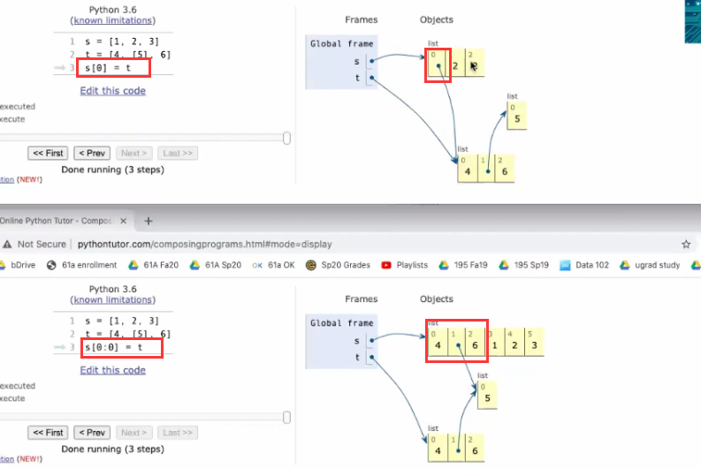

## 可变对象 mutable

对象的指示

list的：append、extend、+ 、slicing、 list()、slice assignment、pop()


关于 slice assignment 的变化解释如下：

> s[0:0] = t   ---->[2,3] 的 0 到 0 处放入 [5,6] 即变为：[5, 6, 2, 3]
>
> s[3:] = t  -----> [5, 6, 2, 3] 的 索引 3 处放入 [5, 6] 即变为：[5, 6, 2, 5, 6]
>
> t[1] = 0  ----> t = [5, 0]   s 不变，说明 slice 不是指向，而是 replace


append、extend、+号都是表达指向

如下面代码进行修改后，str2 也会发生改变。

```python
>>> a = str + [str2]
>>> a
[2, 3, [4, 5]]
>>> a[2]
[4, 5]
>>> a[2][0]
4
>>> a[2][0] = 3
>>> str2
[3, 5]
>>> a
[2, 3, [3, 5]]
```

```python
>>> a = [10]
>>> b = a
>>> a.append(20)
>>> a
[10, 20]
>>> b
[10, 20]
>>> a == b
True
```

> tip: is 的用法，判断是否为一个对象，而 == 只能判断相等。
>
> ```python
>
>>>> a is b
>>>> True
>>>>
>>>
>>
>
> slice 总是创建副本
>
>>>> l1 = [1,2,3]
>>>> l2 = l1[:]
>>>> l1
>>>> [1, 2, 3]
>>>> l2
>>>> [1, 2, 3]
>>>> l1 == l2
>>>> True
>>>> l1 is l2
>>>> False
>>>>
>>>
>>
>
> 但是对于嵌套时再进行切片，会复制指针(其实可以理解为，将所有元素都复制---指针也可以理解为元素)
> ```
>
> 

对比理解



此处需要注意 默认参数的危害：这是由于每次调用时，都绑定到同一个对象。


```python
>>> def f(s=[]):
...    s.append(5)
...    return len(s)
...
>>> f()
1
>>> f()
2
```

```python
>>> p = [1,2,3]
>>> p.append(4)
>>> p
[1, 2, 3, 4]
>>> new_p = p.append(4)
>>> new_p
>>> print(new_p)
None
```

[Why doesn’t list.sort() return the sorted list?](https://docs.python.org/2/faq/design.html#id21)

## 不可变对象 immutable values

可变对象都是在自身进行改变，而不可变对象则生成一个新对象，并不会修改自身。

### 1.字符串

```python
>>> str = 'cs61a'
>>> str[4]
'a'
>>> str[4] = 'b'
Traceback (most recent call last):
  File "<stdin>", line 1, in <module>
TypeError: 'str' object does not support item assignment

>>> 'a' + 'b'
'ab'
>>> 'ab' - 'b'
Traceback (most recent call last):
  File "<stdin>", line 1, in <module>
TypeError: unsupported operand type(s) for -: 'str' and 'str'
```

### 2.元组

```python
>>> t = (1, 2, 3)
>>> t
(1, 2, 3)
>>> t.append(4)
Traceback (most recent call last):
  File "<stdin>", line 1, in <module>
AttributeError: 'tuple' object has no attribute 'append'
>>> t[0]
1
>>> t[0] = 2
Traceback (most recent call last):
  File "<stdin>", line 1, in <module>
TypeError: 'tuple' object does not support item assignment
```

> tips:
>
> 可以这样创建，虽然这样创建很少，但是有时候函数返回 return x,y 。
>
> ```python
>>>> t = 1, 2, 3
>>>> t
> (1, 2, 3)
> ```
>
> 例如这样
>
> ```python
>>>> def f():
> ...    return 1, 2
> ...
>>>> f()
> (1, 2)
>>>> x, y = f()
>>>> x
> 1
>>>> y
> 2
>>>> x, y = (1, 2)
>>>> x
> 1
>>>> y
> 2
> ```

## Mutable Function

Python没有变量声明，因此它必须弄清楚变量本身的范围。 它是通过一个简单的规则来做到这一点的：如果在函数内部存在对变量的赋值，则该变量被视为局部变量。

```python
def fun1():
    x = 5
    def fun2():
        x *= 2
        return x
    return fun2()
```

如上代码，调用fun1()

运行会出错：UnboundLocalError: local variable 'x' referenced before assignment。

这是因为对于fun1函数，x是局部变量，对于fun2函数，x是非全局的外部变量。当在fun2中对x进行修改时，会将x视为fun2的局部变量，屏蔽掉fun1中对x的定义；如果仅仅在fun2中对x进行读取，则不会出现这个错误。

解决办法：使用nonlocal 关键字

### nonlocal

[Stack Overflow上的解释](https://stackoverflow.com/questions/1261875/python-nonlocal-statement)

```python
def make_withdraw(balance):
    def withdraw(amount):
        nonlocal balance
        if amount > balance:
            return 'Insufficient funds'
        balance -= amount
        return balance
    return withdraw

withdraw = make_withdraw(100)
withdraw(25)
withdraw(25)
withdraw(60)
withdraw(15)
```

调用`withdraw`会创建局部帧，`withdraw`创建的帧都扩展自`make_withdraw`的环境，它们都包含`balance`的绑定。所以，它们共享特定的名称绑定，调用`withdraw`具有改变环境的副作用，并且会由之后的`withdraw`调用继承。

通过引入`nonlocal`语句，我们发现了赋值语句的双重作用。它们修改局部绑定，或者修改非局部绑定。实际上，赋值语句已经有了两个作用：创建新的绑定，或者重新绑定现有名称。

Python 赋值的许多作用使赋值语句的执行效果变得模糊。作为一个程序员，你应该用文档清晰记录你的代码，使赋值的效果可被其它人理解。

### 通过 list 保证可变性

除了 nonlocal 也可采用其他方法进行


因此一般通过建立副本，来防止原元素的突变。

```python
s = [1, 2, 3]
t = s
...t... # 对 t 进行操作
```


### Hint : enumerate

```python
    '''
    enumerate 用法
    >>> seasons = ['Spring', 'Summer', 'Fall', 'Winter']
    >>> list(enumerate(seasons))
    [(0, 'Spring'), (1, 'Summer'), (2, 'Fall'), (3, 'Winter')]
    >>> list(enumerate(seasons, start=1))       # 下标从 1 开始
    [(1, 'Spring'), (2, 'Summer'), (3, 'Fall'), (4, 'Winter')]
    '''
    pos = [i for i, x in enumerate(lst) if x == entry]

```
